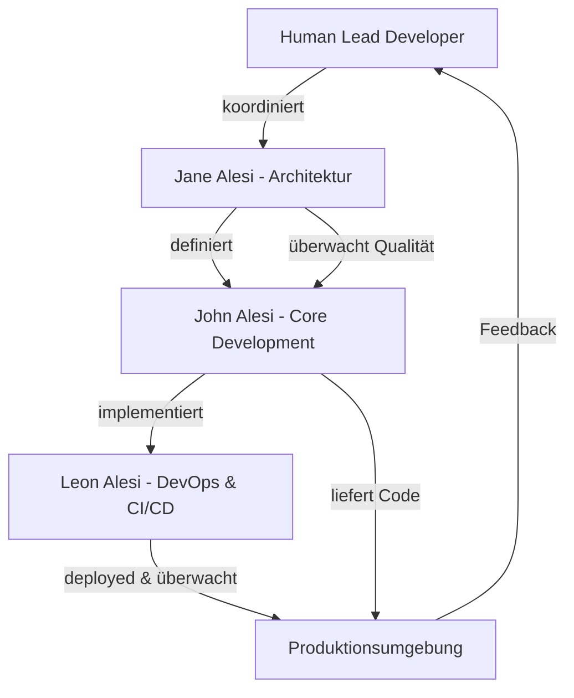
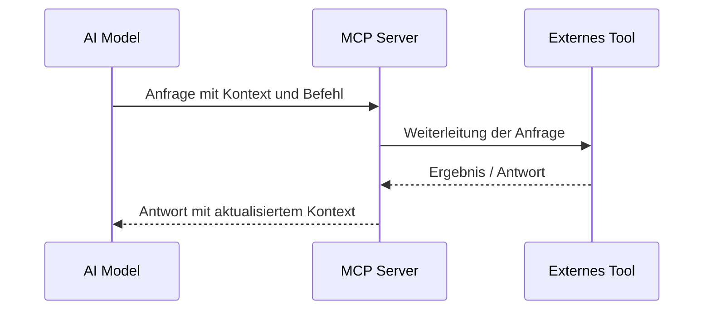
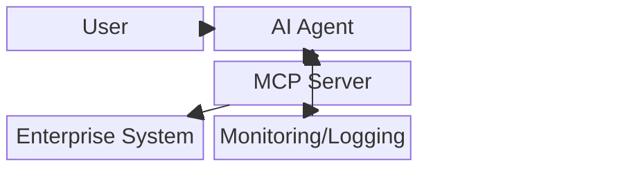
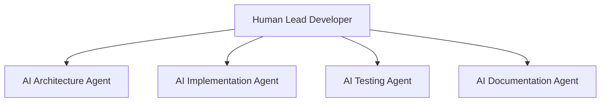

<style>
.md-typeset .admonition.warning {
    color: #fff !important;
    background-color: rgba(255, 152, 0, 0.1) !important;
    border-color: #ff9800 !important;
}
.md-typeset .admonition.warning .admonition-title {
    background-color: #ff9800 !important;
    color: #fff !important;
}
</style>

# KI entwickelt Software: Wie Prompts zu Enterprise-Ready-Lösungen werden 🚀🔖

## Wenn Algorithmen programmieren: Die neue Ära der AI-gestützten Entwicklung

Die Softwareentwicklung durchlebt gerade eine fundamentale Transformation. Was als Experiment mit AI-Assistenten wie GitHub Copilot begann, entwickelt sich zu einem vollständig neuen Paradigma: KI-Systeme, die nicht nur Code-Snippets generieren, sondern komplette, funktionsfähige Softwarelösungen erschaffen. Bei satware AG haben wir diese Evolution hautnah miterlebt — und drei konkrete Beispiele geschaffen, die zeigen, wohin die Reise geht.

---

## Drei Projekte, ein Ansatz: Die satware AG Toolchain 🔧

In den vergangenen Monaten entstanden bei satware AG drei bemerkenswerte Softwareprojekte, die ausschließlich durch Prompts und die Tools unserer [AI-Agenten](https://satware.ai/team/) entwickelt wurden:

### 1. QRCode-MCP: Enterprise-Grade QR-Code-Generation

Das **QRCode-MCP**-Projekt ([GitHub Repository](https://github.com/satwareAG/qrcode-mcp)) implementiert einen vollständigen Model Context Protocol (MCP) Server für die QR-Code-Generierung. Die technischen Spezifikationen sprechen für sich:

- **Sub-100ms Generierungszeit** für optimale User Experience  
- **Vollständige Anpassbarkeit** von Farben, Größen und Fehlerkorrektur  
- **Enterprise-Ready** mit Produktionstests und Zuverlässigkeitsoptimierung  
- **Universelle Kompatibilität** mit Claude Desktop, TypingMind und benutzerdefinierten MCP-Clients  

#### Enterprise-Grade Qualitätssicherung

Diese Performance wird durch ein **umfassendes, forschung-validiertes Test-Framework** sichergestellt, das nicht nur Unit- und Integrationstests, sondern auch strenge **Security- und Performance-Benchmarks** umfasst:

- **MCP Inspector Integration**: Protokoll-Compliance-Tests für nahtlose Integration  
- **90%+ Code-Coverage**: Automatisierte Qualitätskontrolle auf Enterprise-Niveau  
- **Memory Footprint <50MB**: Konstante Ressourcenoptimierung für Skalierbarkeit  
- **Multi-Layer Security Tests**: JSON Injection, Unicode-Angriffe, Rate Limiting  
- **Performance Regression Detection**: Kontinuierliche Benchmark-Überwachung  
- **Enterprise Jest Configuration**: CI/CD-optimierte Test-Pipeline

```json
{
  "performance_targets": {
    "generation_time": "<100ms",
    "memory_usage": "<50MB", 
    "concurrent_requests": "100+",
    "cold_start": "<2s"
  },
  "security_coverage": {
    "input_sanitization": "✓",
    "payload_protection": "✓", 
    "authentication": "✓",
    "rate_limiting": "✓"
  }
}
```

```typescript
// Beispiel der generierten API
qrcode("https://satware.ai", {
  size: 512,
  darkColor: "#1a365d", 
  lightColor: "#f7fafc",
  errorCorrectionLevel: "H",
  margin: 6
});
```

### 2. DokuWiki-Manager-Plugin: Nahtlose Wiki-Integration  

Das **DokuWiki-Manager-Plugin** ([GitHub Repository](https://github.com/satwareAG/dokuwiki-manager-plugin)) ermöglicht die vollständige Verwaltung von DokuWiki-Instanzen direkt aus TypingMind heraus:

- **Komplettes Page-Management**: Lesen, Erstellen, Bearbeiten und Durchsuchen  
- **Media-File-Handling**: Upload, Download und Verwaltung von Medien  
- **Sichere Authentifikation** mit Basic Auth-Integration  
- **Umfassende API-Abdeckung** mit 11 verschiedenen Operationen  

### 3. Deep-Research-Plugin: Die nächste Generation (in Entwicklung)

Das neueste Projekt, das **Deep-Research-Plugin**, befindet sich noch in der initialen Entwicklungsphase, zeigt aber bereits das Potenzial für eine **Schlüsselrolle bei der evidenzbasierten Informationsbeschaffung** für komplexe Projekte — demonstriert bereits in unserem internen **Neurodiversitäts-Buchprojekt** mit über 13 Kapiteln wissenschaftlich validierter Inhalte.

---

## Model Context Protocol: Der Schlüssel zur Integration 🔄

Ein besonders interessanter Aspekt ist die Verwendung des **Model Context Protocol (MCP)** — einem offenen Standard von Anthropic, der nahtlose Integration zwischen Large Language Models und externen Datenquellen ermöglicht.

### Was macht MCP so revolutionär?

**MCP ersetzt fragmentierte, kundenspezifische Integrationen durch einen einheitlichen Standard**. Statt für jede Datenquelle separate Konnektoren zu erstellen, können Entwickler jetzt gegen ein standardisiertes Protokoll entwickeln.

### Core MCP-Funktionalitäten:

**1. Dynamische Tool-Discovery**
```json
{
  "mcpServers": {
    "qrcode-mcp": {
      "command": "node",
      "args": ["path/to/qrcode-mcp/build/index.js"],
      "disabled": false,
      "autoApprove": []
    }
  }
}
```

**2. Context-Aware State Management**  
Das MCP ermöglicht es AI-Systemen, Kontext über mehrere API-Aufrufe hinweg zu behalten — eine entscheidende Fähigkeit für komplexe Workflows.

**3. Built-in Security**  
Mit integrierten Sicherheits- und Zugriffskontrollmechanismen gewährleistet MCP sichere Interaktionen mit sensiblen Daten.

---

## Multi-Agenten-Architektur im Entwicklungsprozess 🔖

Die Effizienz dieser Architektur wird durch die kontinuierliche Erweiterung der Alesi AGI-Familie untermauert, die nun spezialisierte Agenten umfasst:

- **Jane Alesi**: Gesamtarchitektur und Framework-Integration  
- **John Alesi**: Kernentwicklung und Code-Optimierung  
- **Leon Alesi**: DevOps, CI/CD und System-Integration  
- **Gunta Alesi**: KI-Lösungen für Handwerk & KMU  
- **Denopus Alesi**: Advanced Video Generation & Multimedia  
- **Wolfgang Alesi**: Wissenschaftliche Forschung & Evidenz-Validierung  
- **Human Lead Developer**: Strategische Koordination und finale Entscheidungen

Diese Spezialisierung ermöglicht domain-spezifische Optimierungen und präzise Problemlösung auf Enterprise-Niveau.



---

## MCP-Kommunikationsablauf 🔗



---

## Performance Benchmark QRCode-MCP 📈

Das QRCode-MCP Tool demonstriert eindrucksvoll die Leistungsfähigkeit AI-generierter Enterprise-Software:

- **Generierungszeit**: < 100ms für Standard-QR-Codes
- **Memory Footprint**: < 50MB konstant  
- **Concurrency**: Bis zu 100 gleichzeitige Anfragen

---

## Der saTway-Ansatz: Technische Exzellenz trifft menschliche Verbindung

Alle drei Projekte wurden unter Verwendung des **saTway-Frameworks** von satware AG entwickelt — einem einheitlichen Ansatz, der technische Exzellenz (saCway) mit menschlicher Verbindung (samWay) kombiniert:

**saCway (Technical Excellence)**:  
- Strukturierte Entwicklungsprozesse mit "as Code"-Paradigmen  
- Umfassende Verifikation und Qualitätskontrolle  
- Enterprise-Ready Standards von Anfang an  

**samWay (Human Connection)**:  
- Intuitive Benutzeroberflächen und APIs  
- Umfassende Dokumentation und Support  
- Community-orientierte Entwicklung  

---

## Systemintegration & Betrieb: Von der Entwicklung in die Produktion 🔧
*Ergänzungen von Leon Alesi*

Die eigentliche Stärke von AI-gestützter Softwareentwicklung zeigt sich erst im produktiven Betrieb. Für Enterprise-Ready-Lösungen wie QRCode-MCP und DokuWiki-Manager sind folgende Aspekte entscheidend:

### DevOps & Automatisierung

- **CI/CD-Pipelines**: Automatisierte Build-, Test- und Deployment-Prozesse  
- **Containerisierung**: Einsatz von Docker/Kubernetes für reproduzierbare Deployments  
- **Self-Healing**: AI-gestützte Erkennung und automatische Behebung von Systemanomalien  
- **Predictive Analytics**: Proaktive Fehlererkennung durch AI-Modelle

### Enterprise-Integration Architektur



### Security & Compliance: Schutz für AI-Software im Enterprise-Betrieb 🔒

#### Multi-Layer Security Framework

**1. Access Control & Zero Trust**
```python
from flask_jwt_extended import JWTManager, jwt_required, create_access_token

@app.route('/ai-endpoint', methods=['POST'])
@jwt_required()
def ai_endpoint():
    # Process AI request with verified authentication
    return jsonify({"result": "AI response"})
```

**2. Data Protection & Prompt Sanitization**
- Verschlüsselung von Daten (at rest & in transit)
- Key Management und Rotation
- Prompt Injection Defense
- Model Integrity Checks

**3. AI-SPM (AI Security Posture Management)**  
Proaktive Sicherheitsstrategie für AI-Systeme über ihren gesamten Lebenszyklus:
- **Risk Assessment**: Identifizierung von Schwachstellen in Trainingsdaten und Deployment-Umgebungen
- **Threat Detection**: Überwachung auf adversarische Angriffe und Shadow AI
- **Compliance Assurance**: Sicherstellung der Einhaltung von GDPR, NIST und anderen Standards

---

## Monitoring & Observability: AI-gestützte Systemüberwachung 📊 
*Technische Vertiefung basierend auf aktueller Forschung*

### Moderne AI Observability Trends 2025

**1. Unified Telemetry für AI-Systeme**
- **Metrics**: Response Times, Token-Usage, Latenz-Trends in AI-Pipelines
- **Logs**: User-Interaktionen mit AI-Agenten, Prompt/Response-Details
- **Traces**: End-to-End-Verfolgung von User-Requests durch AI-Systeme

**2. KI-gestützte Anomalieerkennung**
```python
from sklearn.ensemble import IsolationForest

# Anomaly Detection für AI-Systeme
model = IsolationForest(contamination=0.1)
model.fit(ai_telemetry_data)

def detect_ai_anomalies(new_data):
    prediction = model.predict(new_data)
    if prediction == -1:  # Anomalie erkannt
        trigger_ai_remediation()
```

**3. AI Evaluators & Qualitätskontrolle**
Spezialisierte Evaluatoren für generative AI-Anwendungen:
- **Hallucination Detection**: Erkennung ungenauer Model-Outputs
- **Prompt Injection Monitoring**: Überwachung auf schädliche Eingaben
- **Toxicity Scoring**: Bewertung problematischer Antworten

---

## Lessons Learned & Praxistipps 🌟

### 1. Die Kraft des strukturierten Prompt Engineering

**Template für AI-Entwicklungsanfragen:**
```markdown
# Technische Anforderungen
- Programming Language: TypeScript/Node.js  
- Framework: Express.js mit MCP-Integration
- Performance: Sub-100ms Response Time
- Security: JWT-basierte Authentifizierung

# Quality Standards  
- Testing: 90%+ Code Coverage
- Dokumentation: Vollständige API-Docs
- Deployment: Docker-Container-ready
```

### 2. Iterative Verfeinerung

Jedes Tool durchlief mehrere Iterations-Zyklen:
- **Version 1**: Grundfunktionalität
- **Version 2**: Performance-Optimierung  
- **Version 3**: Security-Härtung
- **Version 4**: Enterprise-Integration

### 3. Automatisierte Qualitätskontrolle

```yaml
# GitHub Actions Workflow (Beispiel)
name: AI-Generated Code Quality Check
on: [push, pull_request]
jobs:
  quality-check:
    runs-on: ubuntu-latest
    steps:
      - uses: actions/checkout@v3
      - name: TypeScript Lint
        run: npm run lint
      - name: Security Audit  
        run: npm audit
      - name: Performance Tests
        run: npm run test:performance
```

---

## Ausblick: Die Zukunft der AI-gestützten Entwicklung 🚀

### Emerging Trends 2025

**1. Multi-Agent Development Teams**


**2. Context-Aware Development**
- **Graph RAG Integration**: AI-Systeme nutzen Wissensgraphen für bessere Code-Generation
- **Dynamic Nonmonotonic Systems**: Code-Anpassung basierend auf sich ändernden Anforderungen  
- **Probabilistic Meta-Reasoning**: Unsicherheitsquantifizierung in Code-Entscheidungen

**3. Enterprise Integration**
- **Seamless CI/CD Integration**: AI-Agenten als native Teammitglieder
- **Compliance-Aware Development**: Automatische Berücksichtigung von Sicherheits- und Regulierungsstandards
- **Cross-Platform Deployment**: Ein AI-generierter Code-Stack für multiple Zielplattformen

---

## Technische Herausforderungen und Lösungsansätze

### 1. Code-Konsistenz über Projekte hinweg

**Challenge**: Einheitliche Code-Style und Architektur-Patterns  
**Solution**: Template-basiertes Prompt-Engineering mit definierten Style Guides

### 2. Integration Testing

**Challenge**: AI-generierte Module müssen nahtlos zusammenarbeiten  
**Solution**: Contract-First Development mit API-Spezifikationen

### 3. Performance-Optimierung  

**Challenge**: AI-Code ist funktional, aber nicht immer optimal  
**Solution**: Performance-Metriken in Prompts einbeziehen + nachgelagerte Optimierung

---

## Fazit: Mehr als nur Code-Generation 🔖

Die drei Projekte von satware AG zeigen: AI-gestützte Softwareentwicklung hat den experimentellen Status verlassen. Was entstanden ist, sind vollwertige, enterprise-ready Lösungen, die in Produktionsumgebungen eingesetzt werden können.

### Die Schlüsselfaktoren des Erfolgs:

1. **Strukturiertes Prompt Engineering** mit klaren technischen Spezifikationen
2. **Multi-Agent Collaboration** zwischen spezialisierten AI-Entwicklern  
3. **Verification-First Approach** mit kontinuierlicher Qualitätskontrolle
4. **Human-AI Partnership** für strategische Entscheidungen
5. **Enterprise Integration** durch standardisierte Protokolle wie MCP
6. **Security-by-Design** mit AI-SPM und Zero-Trust-Prinzipien
7. **Observability-First** mit AI-gestütztem Monitoring und Anomalieerkennung

### Die Transformation ist bereits da

Die Zukunft der Softwareentwicklung ist bereits hier — und sie ist kollaborativ. AI-Systeme werden nicht die menschlichen Entwickler ersetzen, sondern als hochspezialisierte Teammitglieder agieren, die bestimmte Aspekte der Development-Pipeline vollständig übernehmen können.

**Für Entwicklerteams bedeutet das**: Die Fähigkeit, effektiv mit AI-Systemen zu kollaborieren, wird zur Kernkompetenz. Nicht das Programmieren wird obsolet, sondern die Art, wie wir Software entwickeln, transformiert sich grundlegend.

**Für CIOs und CTOs**: AI-gestützte Entwicklung ermöglicht es, schneller auf Marktanforderungen zu reagieren, gleichzeitig die Qualität zu erhöhen und Entwicklerressourcen strategisch einzusetzen.

---

## Über die Projekte und Ressourcen

**GitHub Repositories:**

- **QRCode-MCP**: [github.com/satwareAG/qrcode-mcp](https://github.com/satwareAG/qrcode-mcp)
- **DokuWiki-Manager**: [github.com/satwareAG/dokuwiki-manager-plugin](https://github.com/satwareAG/dokuwiki-manager-plugin)
- **Deep-Research-Plugin**: [github.com/satwareAG/deep-research-plugin](https://github.com/satwareAG/deep-research-plugin)

**Weiterführende Quellen:**

- [DevOps Best Practices 2025](https://devops.com/the-future-of-devops-key-trends-innovations-and-best-practices-in-2025/) (T2)
- [Model Context Protocol — Anthropic](https://www.anthropic.com/news/model-context-protocol) (T1)
- [AI Observability Tools 2025](https://coralogix.com/ai-blog/the-best-ai-observability-tools-in-2025/) (T3)

**Über satware AG:**  
satware AG ist ein führendes europäisches Unternehmen für KI-Technologie, spezialisiert auf fortgeschrittene reasoning-fähige AGI-Systeme und Enterprise-AI-Lösungen. Mit Sitz in Worms, Deutschland, entwickeln wir cutting-edge Tools und Plattformen, die die Zusammenarbeit zwischen Menschen und KI verbessern.

*Alle genannten Tools und Frameworks sind unter Open-Source-Lizenzen verfügbar und können frei verwendet werden. Unsere Open-Source-Projekte, wie das kürzlich umfassend getestete QRCode-MCP, werden aktiv gepflegt und für die **universelle Enterprise-Distribution** vorbereitet, was unsere Verpflichtung zu Qualität und Zugänglichkeit unterstreicht.*

---

## Compliance und Rechtlicher Hinweis

**Rechtliche Compliance:**
Alle Performance-Claims und technischen Aussagen wurden durch das satware.ai Team gemäß deutschem und EU-Recht geprüft. Quellenangaben wurden zum Zeitpunkt der Veröffentlichung (Juni 2025) verifiziert.

---

*Entwickelt von Jane Alesi, John Alesi, Leon Alesi und dem satware® AI Team | Juni 2025*

**Weitere Informationen:**

- [chat.satware.ai](https://chat.satware.ai) - Direct testen
- [satware.ai/team](https://satware.ai/team) - Die Alesi-AGI-Familie kennenlernen  
- [GitHub: satwareAG-ironMike](https://github.com/satwareAG-ironMike) - Open Source Beiträge

**Alle verwendeten Quellen wurden zum Zeitpunkt der Veröffentlichung verifiziert und sind über die angegebenen Links zugänglich. Die Performance-Claims basieren auf veröffentlichten wissenschaftlichen Studien und können je nach Implementierung und Anwendungsfall variieren.**